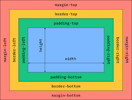

# CSS Box Model



CSS Box Model is a model which thinks every HTML element as a box. The box include 5 properties of CSS: height, width, margin, padding and border. They are defined below.

1. **height:** The *height* property defines the height of an HTML element.

For example

```
.menu {
    height: 200px;
}
```

2. **width:** The *width* property defines the width of an HTMl element.

For example

```
.menu {
    width: 200px;
}
```

3. **margin:** The *margin* property defines a space between two elements.

For example:

```
.menu {
    margin: 20px;
}
```
It sets a margin to all the 4 sides of an element.

Instead, we can set up margin at 4 specific sides of a content with 4 more properties.

1. **margin-top:** This property defines space at the top side of an element.
2. **margin-right:** This property defines space at the right side of an element.
3. **margin-bottom:** This property defines space at the bottom side of an element.
4. **margin-left:** This property defines space at the left side of an element.

There are three shorthand properties too for using margin on 2, 3 or 4 sides.

1. **2 values:** First value will be used for *top and bottom*, and the second value for the *left and right* sides.
2. **3 values:** First value will be used for *top*, second value for *left and right*, and the third value for *bottom* side.
3. **4 values:** First value for *top*, second value for *right*, third value for *bottom* and fourth value for *left* side.

For example

2 values: 
```
margin: 25px 20px; (top-bottom, left-right)
```

3 values:

```
margin: 25px 10px 20px; (top, left-right, bottom)
```

4 values:

```
margin: 25px 10x 20px 5px; (top, right, bottom, left)
```

4. **padding:** The padding property is used for creating space inside an content of an element and its border.

For example:

```
.menu {
    padding: 20px;
}
```
It sets a padding to all the 4 sides of an element.

Instead, we can set up padding at 4 specific sides of a content with 4 more properties.

1. **padding-top:** This property defines space between content and border at the top side of an element.
2. **padding-right:** This property defines space between content and border at the right side of an element.
3. **padding-bottom:** This property defines space between content and border at the bottom side of an element.
4. **padding-left:** This property defines space between content and border at the left side of an element.

The shorthand properties of padding and margin are same.

5. **border:** Borders add a border around an element. 

There are three properties of a border.

1. **border-width:** specifies the width of a border.
2. **border-style:** specifies the style of a border, whether it is solid, or dotted, or dashed etc.
3. **border-color:** specifies the color of a border.

There is a shorthand property for border, which is called *border*.

The structure of *border* shorthand property.

```
border: border-width border-style border-color
```

This shorthand property adds a border all the sides of an element. But we can control the border from any specific side. There are 4 more border shorthand properties for that.

1. **border-top**:  adds a border on the top side of an element
2. **border-right**: adds a border on the right side of an element
3. **border-bottom**: adds a border on the bottom side of an element
4. **border-left**: adds a border on the left side of an element

The structure of these properties are as same as the previous border shorthand property.

We can also give a specific property of the border to a specific side with some other properties:

1. **border-top-width:** adds a top border of the height specified.
2. **border-top-color:** specifies the color of the top border.
3. **border-top-style:** specifies the style of the top border.

Like this, we can do it on the left, right or bottom border.